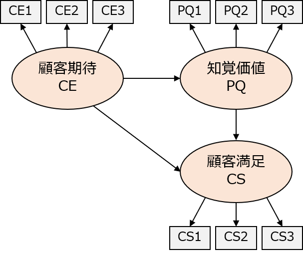
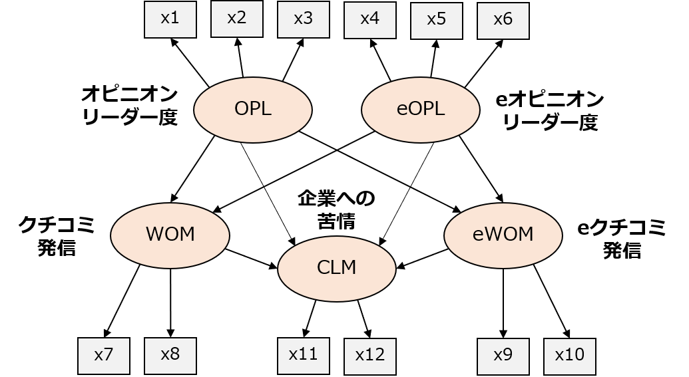

```{r setup, include=FALSE}
knitr::opts_chunk$set(echo = TRUE, message = FALSE)
# packages
library(plotly)
library(broom)
# library(pander)
library(knitr)
library(tidyverse)
```

## 1. 分析例
### データ
**法政大学に対する満足度調査**（data_csi.csv）

```{r, echo=FALSE}
data_csi <- read.csv("data/data_csi.csv")
head(data_csi)
```

| 変数 | 内容                                   |潜在変数	|
| ---- | -------------------------------------- | ----------- |
| CE1 | 入学前に期待していた大学の総合的な品質 |顧客期待（CE）|
| CE2 | 入学前に期待していた学生生活の充実度   |顧客期待（CE）|
| CE3 | 入学前に期待していた大学の信頼度       |顧客期待（CE）|
| PQ1 | 現在感じている大学の総合的な品質       |知覚品質（PQ）|
| PQ2 | 現在感じている学生生活の充実度         |知覚品質（PQ）|
| PQ3 | 現在感じている大学の信頼度             |知覚品質（PQ）|
| CS1 | 大学に対する総合的な満足度             |顧客満足（CS）|
| CS2 | 入学前の期待と比べた現在の大学の評価   |顧客満足（CS）|
| CS3 | 他大学と比較したときの評価             |顧客満足（CS）|


**データ出典**：法政大学の学部授業でアンケートを実施（2018年度）

- 顧客期待（CE：Consumer Expectation），知覚品質（PQ：Perceptual Quality），顧客満足（CS：Consumer Satisfaction）について，それぞれ3問ずつ，7点リッカート尺度（1＝低い ～ 7＝高い）でアンケート収集
- 回答者数は41人


### モデル（パス図）
<br />
<!--  -->
<div style="text-align: center;">

</div>

<!-- #### 数式表記 -->
<!-- 測定方程式（確認的因子分析） -->
<!-- $$ -->
<!-- y_1 = \lambda_{11} CE + e_1 \\ -->
<!-- y_2 = \lambda_{21} CE + e_2 \\ -->
<!-- y_3 = \lambda_{31} CE + e_3 \\ -->
<!-- y_4 = \lambda_{42} PQ + e_4 \\ -->
<!-- y_5 = \lambda_{52} PQ + e_5 \\ -->
<!-- y_6 = \lambda_{62} PQ + e_6 \\ -->
<!-- y_7 = \lambda_{73} CS + e_7 \\ -->
<!-- y_8 = \lambda_{83} CS + e_8 \\ -->
<!-- y_9 = \lambda_{93} CS + e_9 -->
<!-- $$ -->

<!-- 構造方程式（回帰分析） -->
<!-- $$ -->
<!-- PQ = \beta_{11} CE + v_1 \\ -->
<!-- CS = \beta_{21} CE + \beta_{22} PQ + v_2 -->
<!-- $$ -->


### Rコード
```{r message=FALSE, warning=FALSE, results='hide'}
# lavaan と psych パッケージのインストール（初回のみ実行）
# install.packages("lavaan") 
# install.packages("psych") 

# パッケージの読込み
library(lavaan)
library(psych)

# データの読み込み
data_csi <- read.csv("data/data_csi.csv")

# 信頼性係数（クロンバックのアルファ）の確認
CE_alpha <- alpha(data_csi[, 1:3]) # データの1~3列目のCEの質問を指定（以下同様）
PQ_alpha <- alpha(data_csi[, 4:6])
CS_alpha <- alpha(data_csi[, 7:9])

summary(CE_alpha)
summary(PQ_alpha)
summary(CS_alpha)

# モデル（パス図）定義
model <- "
  # 測定方程式
    CE =~ CE1 + CE2 + CE3  # 顧客期待 (CE)
    PQ =~ PQ1 + PQ2 + PQ3  # 知覚品質 (PQ)
    CS =~ CS1 + CS2 + CS3  # 顧客満足 (CS)
  # 構造方程式
    PQ ~ CE
    CS ~ CE + PQ
"

# パラメータ推定
result <- sem(model, data = data_csi)

# 推定結果
summary(result, standardized = TRUE)

# モデル比較指標
fitMeasures(result, fit.measures = c("chisq", "df", "pvalue", "cfi", "gfi", "rmsea"))
```

**`alpha(data)`：クロンバックアルファの計算**

- **`data`**：クロンバックアルファを計算したいデータの指定


**`sem(model, data)`：共分散構造分析の実行**

- **`model`**：モデル（パス図）定義
  - モデルは " "（または ' '）で囲んで定義する
  - モデルの書き方は下記を参照
  
- **`data`**：分析データの指定  


#### モデル（パス図）定義の書き方

**測定方程式**

- 「潜在変数 =~ 観測変数1 + 観測変数2」のように，`=~` の左側に潜在変数，右側に潜在変数を構成する観測変数を記述
- 観測変数が2個以上ある場合は `+` で追加する


**構造方程式**

- 「潜在変数1 ~ 潜在変数2 + 潜在変数3」のように，`~` の左側に「矢印を受ける潜在変数（終点）」，「矢印を出す潜在変数（始点）」を記述
- 複数の始点がある場合は `+` で追加する
- 潜在変数間の相関関係をモデル化したい場合は「潜在変数1 ~~ 潜在変数2」のように，`~~` で潜在変数をつなげる


#### Rコードの出力
##### 信頼性係数（クロンバックのアルファ）
```{r, echo=FALSE, results='hold'}
summary(CE_alpha)
summary(PQ_alpha)
summary(CS_alpha)
```

##### 推定結果
```{r, echo=FALSE}
smry <- summary(result, standardized = TRUE)
smry
```

##### モデル比較指標
```{r, echo=FALSE}
fitMeasures(result, fit.measures = c("chisq", "df", "pvalue", "cfi", "gfi", "rmsea"))
```


### 推定結果
（潜在変数間のパス係数のみ記載）
```{r, echo=FALSE}
par <- smry$pe
result.df <- data.frame(#rname = c("知覚品質 ← 顧客期待", "顧客満足 ← 顧客期待", "顧客満足 ← 知覚品質"), 
                        rname = c("顧客期待 → 知覚品質", "顧客期待 → 顧客満足", "知覚品質 → 顧客満足"),
                        par$est, par$se, par$pvalue, par$std.all)[10:12,] %>%
  kable(format = "markdown",
        row.names = FALSE,
        col.names = c("", "係数", "標準誤差", "p 値", "標準化係数"),
        digits = 3)
result.df
```


「顧客期待 → 知覚品質」のパスは 0.493 (標準化係数 0.536) で有意に推定されているが，「顧客期待 → 顧客満足」のパスは有意でなく，入学前の期待は大学への品質評価に繋がっているが，大学への満足度には直接繋がっていないことが分かる。「知覚品質 → 顧客満足」のパスは 1.285 (標準化係数 1.045) で有意であり，大学への品質評価は満足度に繋がっており，また，入学前の期待は大学への品質評価を通じて満足度に繋がっている。

パス図を作成する際，パス係数は標準化係数（Rの結果出力で `Std.all` の列の値）を用いる。以下に，`semPlot`パッケージを利用したパス図の自動作成プログラムを紹介するが，潜在変数が多い場合に座標調整が面倒なため，パス図はPowerPoint等で作図することを推奨する。


#### （参考）semPlot パッケージによるパス図の自動作成
```{r, message=FALSE, echo=FALSE}
library(semPlot)
semPaths(result, what = "std", style = "lisrel")
```

```{r, message=FALSE, eval=FALSE}
# install.packages("semPlot") 

library(semPlot)
semPaths(result, what = "std", style = "lisrel")
```


## 2. データ分析実習
### データ
**クチコミとオピニオン・リーダーに関する調査データ**（data_wom.csv）

```{r, echo=FALSE}
data_wom <- read.csv("data/data_wom.csv")
head(data_wom)
```

<!-- | 変数     | 定義                                                         | -->
<!-- | -------- | ------------------------------------------------------------ | -->
<!-- | SampleID | 回答者ID                                                     | -->
<!-- | x1       | 友人や近所の人と映画についてよく話しをする                   | -->
<!-- | x2       | 友人や近所の人に映画の情報を教える方だ                       | -->
<!-- | x3       | 友人や近所の人から映画についての情報を求められる方だ         | -->
<!-- | x4       | インターネット上で映画について投稿したり読んだりする方だ     | -->
<!-- | x5       | インターネット上で映画の情報を教える方だ                     | -->
<!-- | x6       | インターネット上で人から映画についての情報を求められる方だ   | -->
<!-- | x7       | 満足，面白いと思った映画について友人などに伝える             | -->
<!-- | x8       | 不満，面白くないと思った映画について友人などに伝える         | -->
<!-- | x9       | 満足，面白いと思った映画についてインターネットの掲示板などに書き込む | -->
<!-- | x10      | 不満，面白くないと思った映画についてインターネットの掲示板などに書き込む | -->
<!-- | x11      | 不満，面白くないと思った映画について映画，配給元に電話する   | -->
<!-- | x12      | 不満，面白くないと思った映画について映画，配給元にメールする | -->

| 変数     | 定義                                                         | 潜在変数	|
| -------- | ------------------------------------------------------------ | ----------- |
| SampleID | 回答者ID                                                     | 			|
| x1       | 友人や近所の人と映画についてよく話しをする                   | オピニオン・リーダー度 (OPL) |
| x2       | 友人や近所の人に映画の情報を教える方だ                       | オピニオン・リーダー度 (OPL) |
| x3       | 友人や近所の人から映画についての情報を求められる方だ         | オピニオン・リーダー度 (OPL) |
| x4       | インターネット上で映画について投稿したり読んだりする方だ     | eオピニオン・リーダー度 (eOPL) |
| x5       | インターネット上で映画の情報を教える方だ                     | eオピニオン・リーダー度 (eOPL)|
| x6       | インターネット上で人から映画についての情報を求められる方だ   | eオピニオン・リーダー度 (eOPL)|
| x7       | 満足，面白いと思った映画について友人などに伝える             | クチコミ発信 (WOM) |
| x8       | 不満，面白くないと思った映画について友人などに伝える         | クチコミ発信 (WOM) |
| x9       | 満足，面白いと思った映画についてインターネットの掲示板などに書き込む | eクチコミ発信 (eWOM) |
| x10      | 不満，面白くないと思った映画についてインターネットの掲示板などに書き込む | eクチコミ発 信 (eWOM) |
| x11      | 不満，面白くないと思った映画について映画，配給元に電話する   | 企業への苦情 (CLM) |
| x12      | 不満，面白くないと思った映画について映画，配給元にメールする | 企業への苦情 (CLM) |

**データ出典**：里村（2014）および濱岡・里村（2009）を元に作成したシミュレーションデータ

- それぞれの質問項目は7点尺度（1＝全く当てはまらない ～ 7＝非常に当てはまる）の回答
- 質問項目 x1～x12 の数値は，里村（2014）に記載された相関係数行列より復元したシミュレーションデータで実際のアンケート回答結果とは異なる
<br />

**参考文献**  
[里村卓也 (2014) 『マーケティング・データ分析の基礎』共立出版](http://www.kyoritsu-pub.co.jp/bookdetail/9784320123663)  
[濱岡豊, 里村卓也 (2009) 『消費者間の相互作用についての基礎研究 : クチコミ、eクチコミを中心に』慶應義塾大学出版](http://www.keio-up.co.jp/np/isbn/9784766415971)


### 課題
以下のパス図で共分散構造分析を実行し，リアルとインターネットでのオピニオンリーダー度（OPLとeOPL）は，リアルとインターネットでのクチコミ発信（WOMとeWOM）にどのような影響を与えているか考察せよ。

- 天井・床効果とクロンバックアルファの確認は省略してよい。


#### モデル（パス図）
<div style="text-align: center;">

</div>

<!-- #### 数式表記 -->
<!-- 測定方程式（確認的因子分析） ⇒ 省略 -->

<!-- 構造方程式（回帰分析） -->
<!-- $$ -->
<!-- WOM = \beta_{11} OPL + \beta_{12} eOPL + v_1 \\ -->
<!-- eWOM = \beta_{21} OPL + \beta_{22} eOPL + v_2 \\ -->
<!-- CLM = \beta_{31} OPL + \beta_{32} eOPL + \beta_{41} WOM + \beta_{52} eWOM + v_3 -->
<!-- $$ -->


<br />
<details><summary>Rコード（クリックで表示）</summary><div>
```{r, eval=FALSE}
library(lavaan)

# データの読み込み
data_wom <- read.csv("data/data_wom.csv")

# モデル（パス図）定義
model <- "
  # 測定方程式
    OPL =~ x1 + x2 + x3
    eOPL =~ x4 + x5 + x6
    WOM =~ x7 + x8
    eWOM =~ x9 + x10
    CLM =~ x11 + x12
  # 構造方程式
    WOM ~ OPL + eOPL
    eWOM ~ OPL + eOPL
    CLM ~ OPL + eOPL + WOM + eWOM
"

# パラメータ推定
result <- sem(model, data = data_wom)

# 推定結果の表示
summary(result, standardized = TRUE) 

# モデル比較指標
fitMeasures(result, fit.measures = c("chisq", "df", "pvalue", "cfi", "gfi", "rmsea"))

# semPlot パッケージによる作図プログラム
library(semPlot)
semPaths(result, what = "std", style = "lisrel", reorder = FALSE, optimizeLatRes = TRUE,
         manifests = c("x1","x2","x3","x4","x5","x6","x7","x8","x11","x12","x9","x10"),
         latents = c("OPL","eOPL","WOM","CLM","eWOM"))
```
</div></details>


