```{r setup, include=FALSE}
knitr::opts_chunk$set(echo = TRUE)
library(plotly)
library(knitr)
```

## 1. RとRStudioのインストール
以下のwebサイトからインストーラーをダウンロードしてインストール。

- [R Project (https://www.r-project.org/)](https://www.r-project.org/) → 左メニューの"CRAN"から"0-Cloud" を進み，"base"を選択
- [RStudio (https://rstudio.com/products/rstudio/)](https://rstudio.com/products/rstudio/)  → RStudio Desktop をインストール

\
図1：RStudio の起動画面
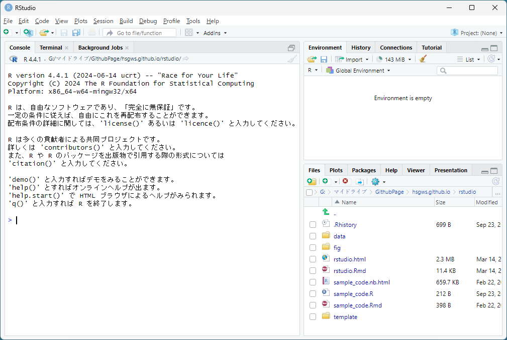


## 2. Project の作成
データなどのファイル管理のため最初に以下の手順で授業用の Project を作成する。

1. 「File」→「New Project」→「New Directory」→「New Project」を選択
2. 「Directory name」に Project 名を入力（例：seminar）

デフォルトでは，

- Windows はドキュメントフォルダ（C:\\Users\\[ユーザー名]\\Documents）
- Mac はユーザーフォルダ（/User/[ユーザー名]）

に Project フォルダと拡張子が「Rproj」のファイルが作成される（例：seminar.Rproj）。
授業ではこのファイルを開いて Rstudio を起動する。

\
図2：Project の作成画面
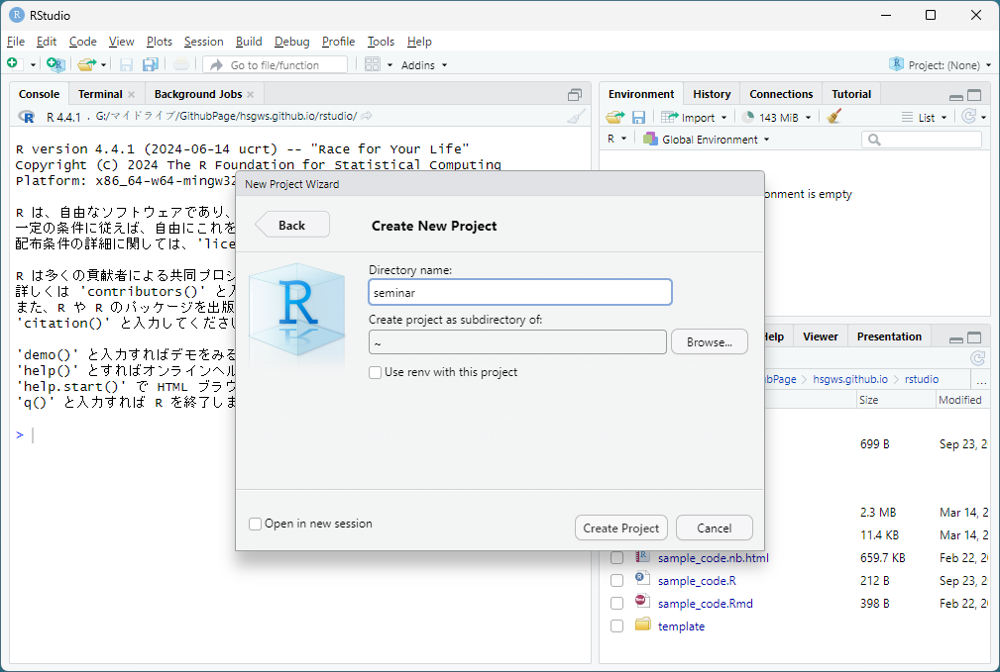


## 3. データの読み込み
以降では Project フォルダ内の data フォルダに sample_data.csv が保存されていることを前提とする。

### Import Dataset

1. 「Import Dataset」（右上ペインの Environment）→「From Text (base)」または「From Text (readr)」
2. 読み込むデータを指定し，必要に応じて左側のオプションを変更（特にデータの列名 Heading やデータの区切り Separator に注意）
3. 下部の「Import」をクリック

基本的には「From Text (base)」を選択すれば良いが，データ内に日時や文字（都道府県名など）の列があって読み込みに失敗する場合は「From Text (readr)」を選択して，各列の定義を指定するとうまく読み込める。

\
図3：データ選択後の画面
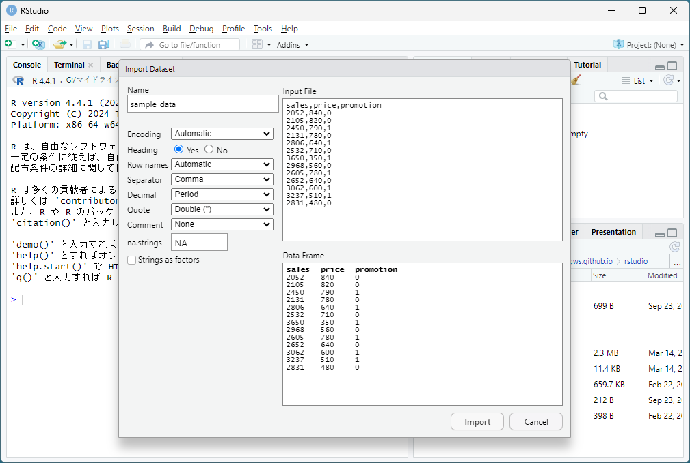


### read.table 関数
複数のデータを一度に読み込みたい場合やサイズの大きなデータ（数十メガバイト～）を読み込みたい場合は，プログラム内で `read.table` 関数を実行した方が処理が早い。

```{r eval=FALSE, include=TRUE}
sample_data <- read.table("data/sample_data.csv", header = TRUE, sep = ",")
# または
sample_data <- read.csv("data/sample_data.csv")
```

- `header`: データの1行目に列名が含まれるなら `TRUE`，含まれないなら `FALSE`
- `sep`: データがカンマで区切られているCSVなら `","`，スペースなら `""`，Tabなら `"\t"`
- CSVデータは `read.csv` 関数でも読み込み可能で，`header` と `sep` の引数を省略できる

R では `<-` の

- 右側に実行する関数とその引数（上記プログラムでは `read.table` や `header` など）
- 左側に出力の名前（同じく `sample_data`）

を定義することでプログラムを記述していく。


## 4. プログラムの実行
R では Console に直接プログラムを入力して実行するのではなく，プログラムファイルを作成して実行する方が望ましい。
Console に直接入力する方法は，実行のたびにプログラムを入力する必要があったり，複数行のプログラムを実行するのが面倒だったりする。
以下では，R Script と R Notebook によるプログラム実行の方法を紹介する。

### R Script
#### R Script の作成

1. 「File」→「New File」→「R Script」を選択
2. 開いたエディタに実行するプログラムを入力
3. 「File」→「Save」を選択して R Script を保存

実行するプログラムを R Script としてパソコンに保存しておけば，再度実行したい際にそのファイルを読み込めばよい。
Project を開いている場合は R Script はデフォルトでは Project フォルダに保存される。
保存した R Script は 「File」→「Open File...」から開くことができる。
または，Rstudio の右下ペインの「Files」に表示される Project フォルダのファイル一覧から開くことができる。

\
図4：R Script へプログラムを入力した画面
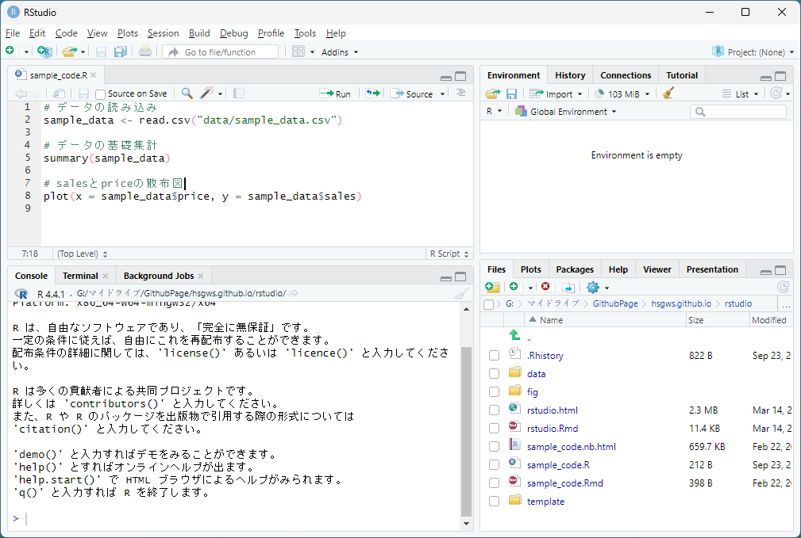

上記画像のプログラム
```{r eval=FALSE, include=TRUE}
# データの読み込み
sample_data <- read.csv("data/sample_data.csv")

# データの基礎集計と散布図
summary(sample_data)
plot(x = sample_data$price, y = sample_data$sales)

# 回帰分析
result <- lm(sales ~ price + promotion, data = sample_data)
summary(result)
```

sample_data.csv の一部
```{r echo=FALSE}
head(read.csv("data/sample_data.csv"))
```

\
「(データ名)\$(列名)」でデータ内の特定の列を指定できる。`sample_data$sales` は sample_data の sales 列。
RStudio にはコード補完機能があり，関数やデータを途中まで入力すると候補が表示されて，キーボードの Tab で選択・補完ができる。


#### R Script の実行

1. エディタ上部の「Source」横の下矢印 → 「Source with Echo」をクリック
2. Console と Plots に実行結果が出力される

特定の行のみ実行したい場合は，実行したい行（複数行も可）を選択して上部の「Run」をクリック。

\
図5：R Script 実行後の画面
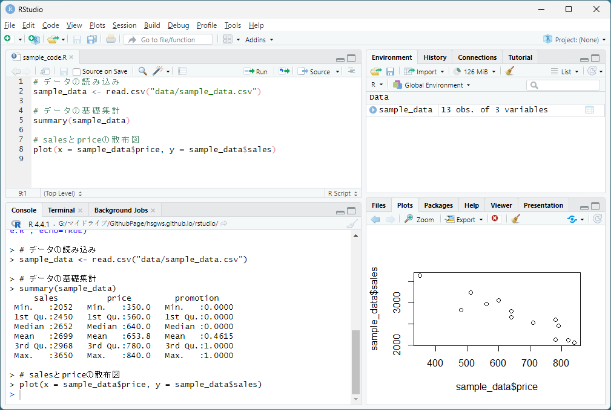


### R Notebook

R Notebook を使うと R プログラムと分析結果を同時に HTML ファイルで保存できるため，分析結果を見直したい場合に再度プログラムを実行する必要がなくなる。R プログラム以外の文章もマークダウン形式で追加することが可能。


#### R Notebook の作成

1. 「File」→「New File」→「R Notebook」を選択（テンプレートファイルが開くので，6行目以降を削除）
2. 「Code」→「Insert Chunk」を選択して R チャンクを追加
3. R チャンク内に実行したいプログラムを入力

\
図6：R Notebook を開いてテンプレートが表示された画面
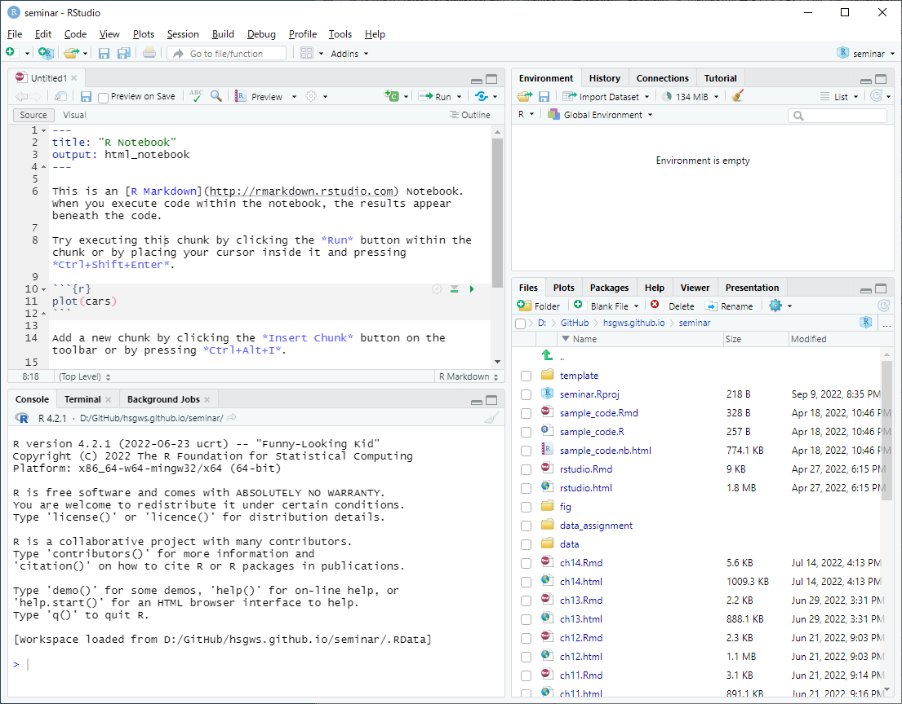

\
図7：R チャンクを追加してプログラムを入力した画面
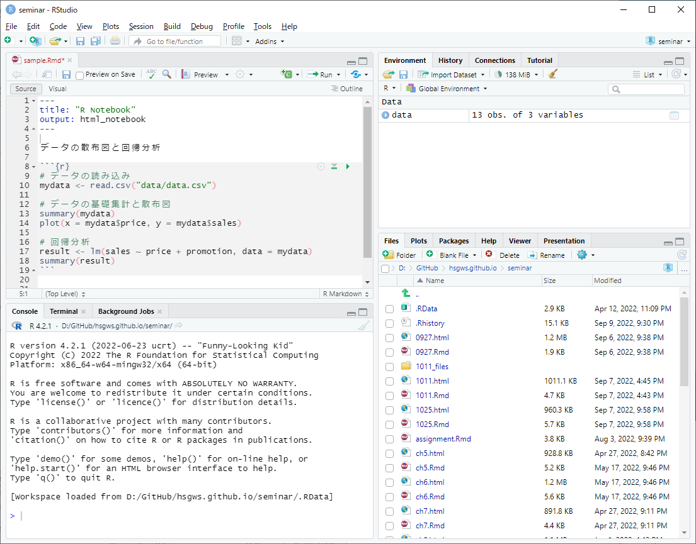

上記 R Notebook ファイルの入力内容

````
---
title: "R Notebook"
output: html_notebook
---

データの散布図と回帰分析

`r ''````{r}
# データの読み込み
sample_data <- read.csv("data/sample_data.csv")

# データの基礎集計と散布図
summary(sample_data)
plot(x = sample_data$price, y = sample_data$sales)

# 回帰分析
result <- lm(sales ~ price + promotion, data = sample_data)
summary(result)
`r ''````
````

#### R プログラムの実行と保存

1. R チャンク右上の緑色の三角マークをクリックして R プログラムを実行
2. 「File」→「Save」で保存すると，R Notebook ファイル（拡張子 Rmd）と同ファイル名の HTML ファイルが作成される 
→ [作成された HTML ファイル](sample_code.nb.html)

\
図8：R チャンクを実行後の画面
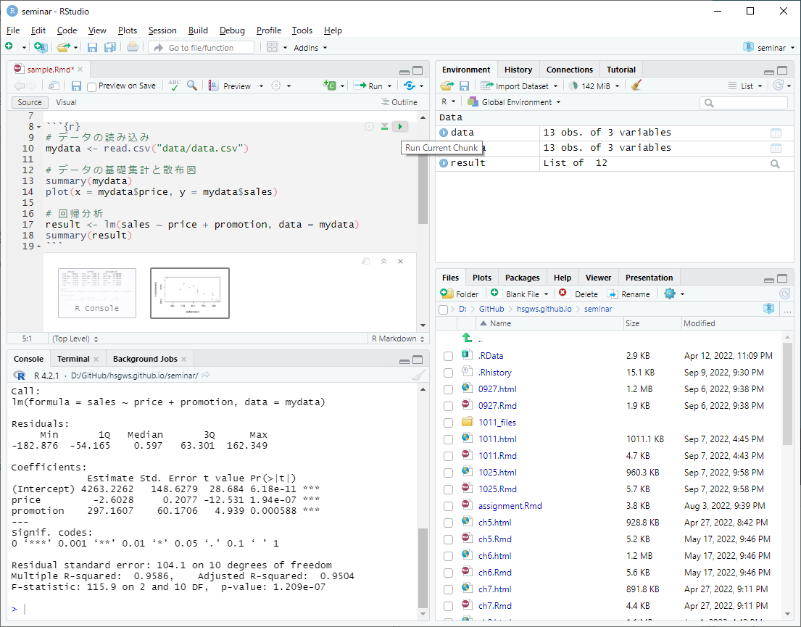

\

- R Notebook では R チャンク外に R プログラム以外のテキストも入力できる。
- R Notebook 以外にも R Markdown を利用すると，プログラムとその分析結果の出力を整形して HTML や PDF で保存できる。詳細は末尾の参考サイト・書籍の2，3などを参照。


## 5. その他

#### パッケージのインストール
R ではパッケージをインストールすることで機能を拡張できる。
パッケージのインストールは右下ペイン Packages タブの Install からパッケージ名を指定してインストールできる。

\
図9：パッケージのインストール画面
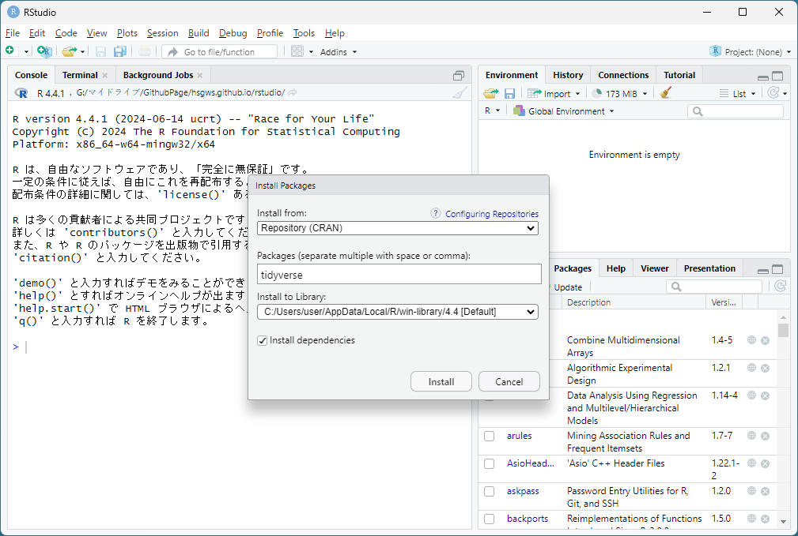
\

#### 関数のヘルプ
関数の引数や出力の意味，サンプルプログラムなどは右下ペイン Help から検索・閲覧できる。
以下はヘルプ内の基本的な項目。

- Usege：関数の使い方
- Arguments：関数の引数とそのデフォルト設定
- Value：出力される変数の意味
- Examples：サンプルコード

\
図10：ヘルプ表示画面
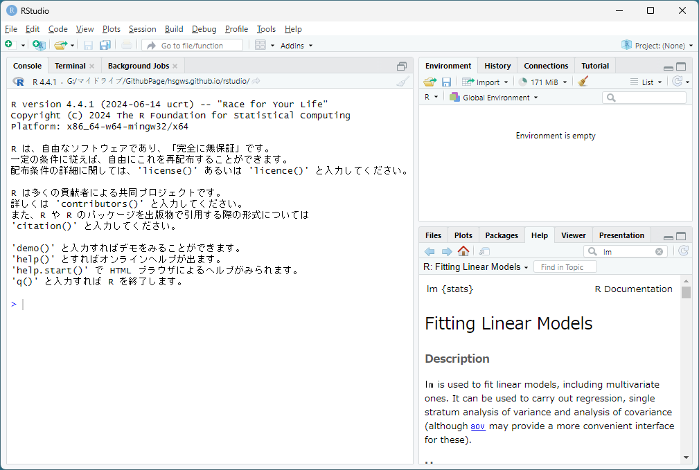
\

#### 文字化け
データに日本語などの全角文字が含まれると読み込み時に文字化けが起こる場合がある。
文字化けを防ぐためには全角文字を使わないか，データ読み込み時に文字コードを指定する。
文字コードを事前に調べられない場合は，Import Dataset のオプションの Encoding で「UTF-8」か「shift-jis」のどちらか，文字化けしない方を指定すればよい。

R Script（プログラムファイル）が文字化けする場合は，Rstudio上部のメニューから「Tools」→「Global Options」→「Code」→「Saving」と進み，Default text encoding を「UTF-8」か「CP932」の System default と表示されていない方を選択して，再度 R Script を読み込む。
Windows と Mac でファイルを共有する場合に文字化けが起こりやすい。

\
図11：文字コードの選択
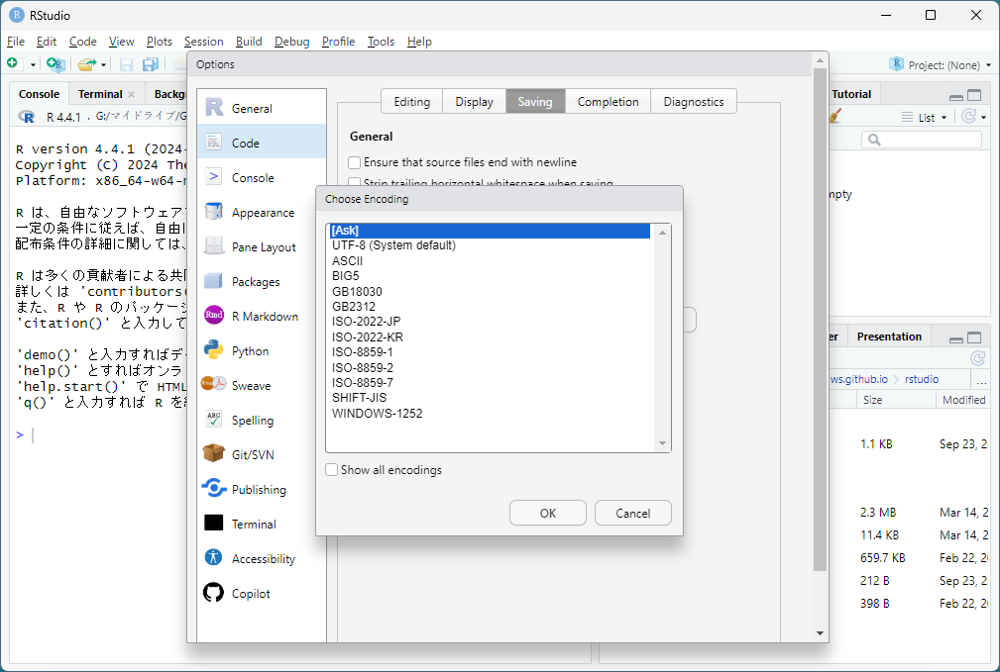
\

#### エラーメッセージの対応
間違ったプログラムを実行すると赤文字でエラーメッセージが出力されることがある。
その場合は出力されたエラー文章でウェブ検索すると多くの場合は解決策が見つかる。


## Rに関する参考サイト・書籍
1. [R-Tips (http://cse.naro.affrc.go.jp/takezawa/r-tips/r2.html)](http://cse.naro.affrc.go.jp/takezawa/r-tips/r2.html)
2. [Rビギナーズガイド (https://syunsuke.github.io/r_beginners_guide/)](https://syunsuke.github.io/r_beginners_guide/)
3. [松村他 (2021) 『改訂2版 Rユーザのための RStudio［実践］入門』技術評論社](https://gihyo.jp/book/2021/978-4-297-12170-9)

以下の書籍は法政大学図書館の電子ブック [KinoDen](https://opac.lib.hosei.ac.jp/opac/myopac/gateway/list/search/kywd=KinoDen/) で閲覧可能。

4. [浅野・中村（2018）『はじめてのRStudio エラーメッセージなんかこわくない』オーム社](https://www.ohmsha.co.jp/book/9784274222931/) ⇒  [KinoDenリンク](https://kinoden.kinokuniya.co.jp/hosei_u/bookdetail/p/KP00024391)
5. [高橋（2018）『再現可能性のすゝめ RStudioによるデータ解析とレポート作成（Wonderful R）』共立出版](https://www.kyoritsu-pub.co.jp/book/b10003938.html) ⇒   [KinoDenリンク](https://kinoden.kinokuniya.co.jp/hosei_u/bookdetail/p/KP00041680)