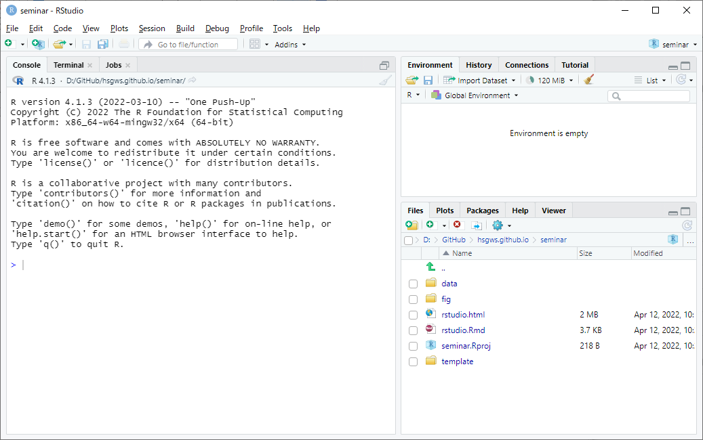
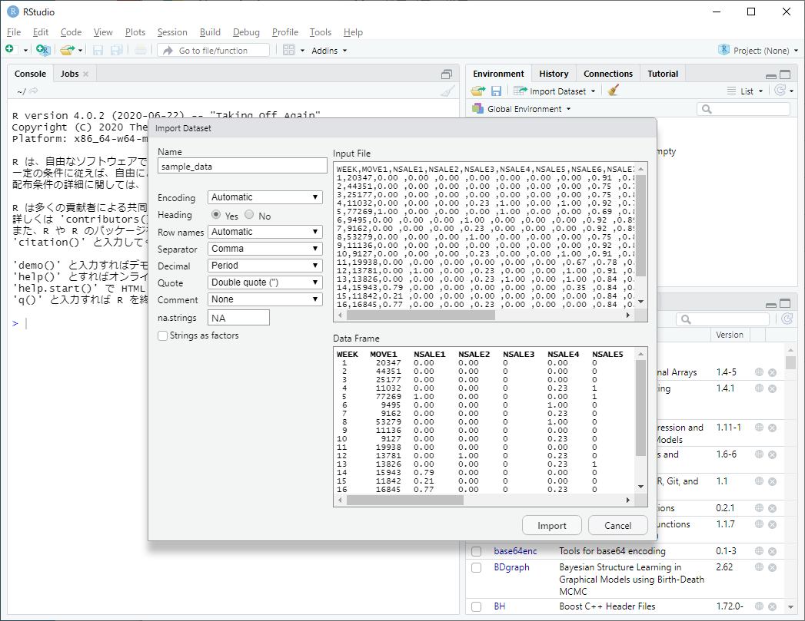
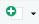
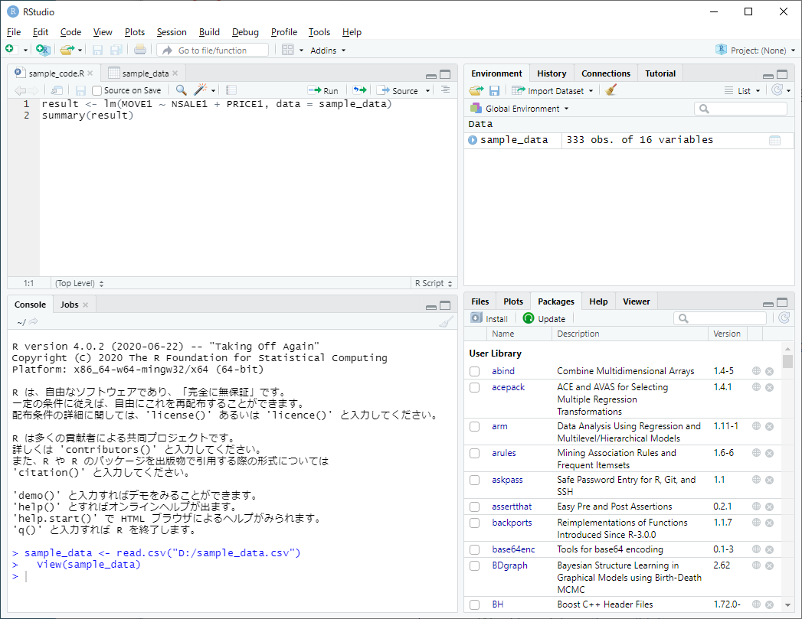
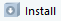
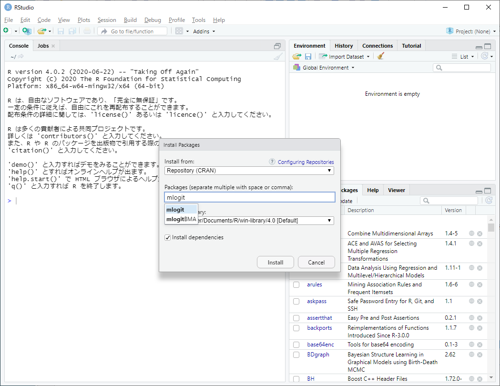

```{r setup, include=FALSE}
knitr::opts_chunk$set(echo = TRUE)
library(plotly)
```

## 1. RとRStudioのインストール
以下のwebサイトからインストーラーをダウンロードしてインストール。

- [R Project (https://www.r-project.org/)](https://www.r-project.org/) → 左メニューの"CRAN"から"0-Cloud"または好きな国のリンクを進み，"base"を選択
- [RStudio (https://rstudio.com/products/rstudio/)](https://rstudio.com/products/rstudio/)  → RStudio Desktop をインストール

## 2. RStudioの使い方
### 2.1. 起動画面




### 2.2. データの読み込み

- 右上ペインの  ボタンから「From Text (base)」または「From Text (readr)」を選択し，読み込むデータを指定
  - 基本的には「From Text (base)」を選択すれば良いが，データ内に日時や文字（都道府県名など）の列があって読み込みに失敗する場合は，「From Text (readr)」を選択して，各列の定義を指定するとうまく読み込める
- 以下では「From Text (base)」による読込方法を紹介するが，データサイズが大きい場合（数十メガバイト）や複数のデータを一度に読み込みたい場合は `read.table` 関数によるデータ読み込みを推奨


<br />
データ指定後には，読み込みデータに合わせて左側のオプションを変更する。特にデータの列名（Heading）の指定に注意。



<br />
データ読み込み後の画面


#### `read.table` 関数によるCSVデータ読み込み
```{r eval=FALSE, include=TRUE}
data <- read.table("[データの保存場所]/data.csv", header = TRUE, sep = ",")
# または
data <- read.csv("[データの保存場所]/data.csv")
```

- `header`: データの1行目に列名が含まれるなら `TRUE`，含まれないなら `FALSE`
- `sep`: データがカンマで区切られているCSVなら `","`，スペースなら `""`，Tabなら `"\t"`
- CSVデータは `read.csv` 関数でも読み込み可能


<!-- ### 2.3. プログラムの実行 -->
<!-- #### エディタの表示 -->
<!-- 左上の  ボタンから "R Script"  を選択してRプログラムを編集するエディタを表示（または Ctrl+Shift+N）。 -->

<!-- <div style="text-align: center;"></div> -->

<!-- #### プログラムの入力 -->
<!-- エディタに実行したいプログラムを入力する。Rプログラムはファイルとして保存しておけば再利用が可能。 -->

<!-- <div style="text-align: center;"></div> -->

<!-- #### 特定の行のみ実行 -->
<!-- 実行したい部分を選択してエディタ上部の  ボタンをクリック（または Ctrl+Enter） -->

<!-- #### 全てを一括で実行 -->
<!-- エディタ上部の  ボタンの逆三角から Source with Echo をクリック（または Ctrl+Shift+Enter） -->

<!-- <br /> -->
<!-- Rプログラム実行後の画面 -->
<!-- <div style="text-align: center;"></div> -->

<!-- ### 2.4. パッケージのインストール -->
<!-- 右下のペインの Packages から  ボタンをクリックし，インストールしたいパッケージ名を入力して "Install" をクリック。 -->

<!-- <div style="text-align: center;"></div> -->

<!-- ### 2.5. Projectの作成 -->

<!-- -  -->


## Rに関する参考サイト・書籍
- [R-Tips (http://cse.naro.affrc.go.jp/takezawa/r-tips/r2.html)](http://cse.naro.affrc.go.jp/takezawa/r-tips/r2.html)
- [R による統計処理  (http://aoki2.si.gunma-u.ac.jp/R/)](http://aoki2.si.gunma-u.ac.jp/R/)
- [松村他 (2021) 『改訂2版 Rユーザのための RStudio［実践］入門』技術評論社](https://gihyo.jp/book/2021/978-4-297-12170-9)