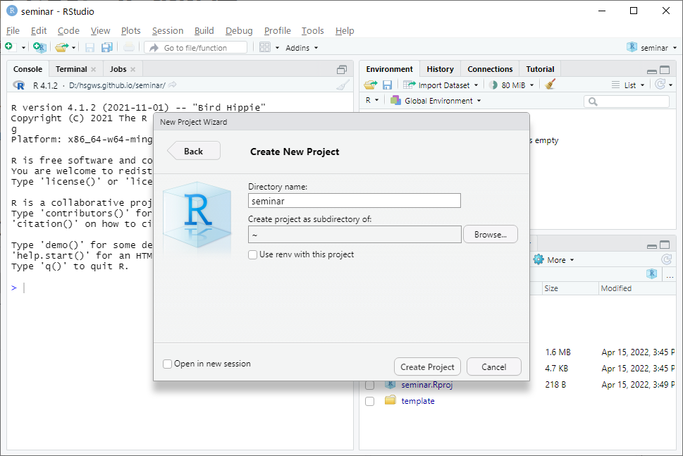
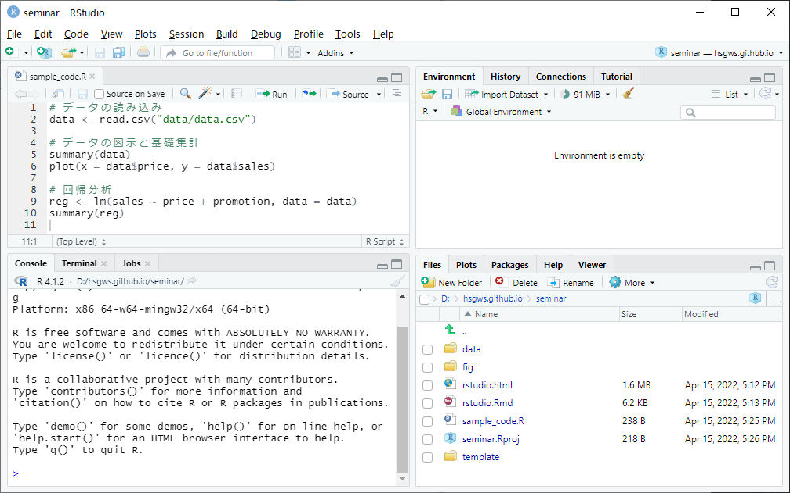
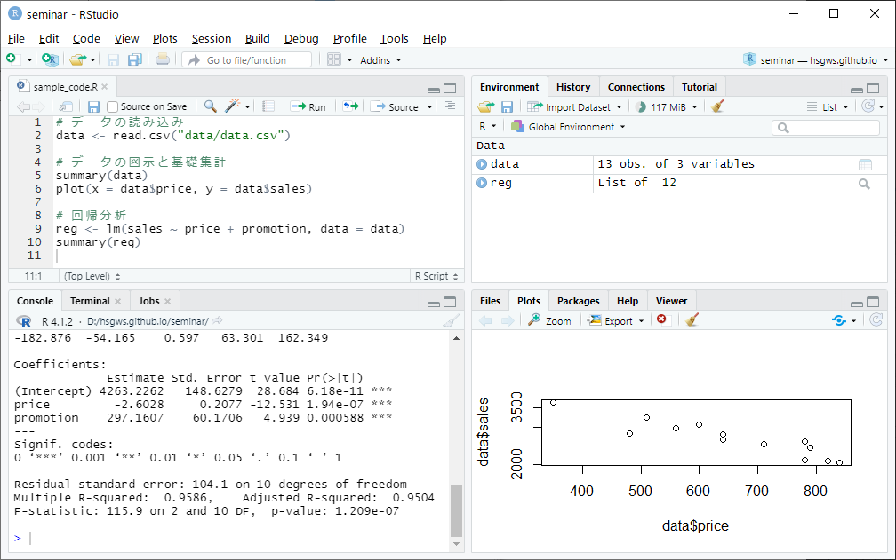
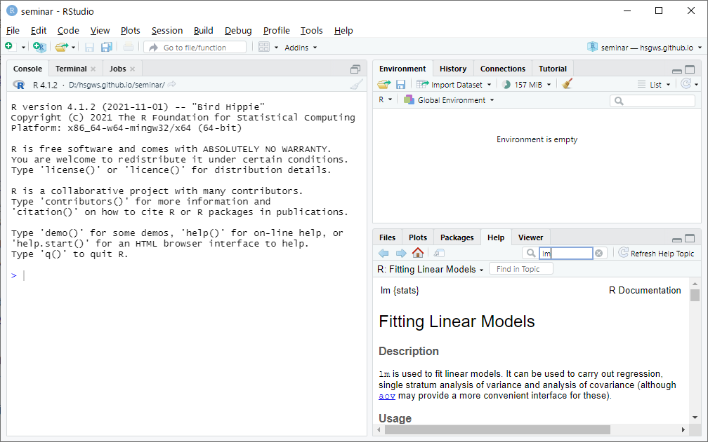

```{r setup, include=FALSE}
knitr::opts_chunk$set(echo = TRUE)
library(plotly)
```

## 1. RとRStudioのインストール
以下のwebサイトからインストーラーをダウンロードしてインストール。

- [R Project (https://www.r-project.org/)](https://www.r-project.org/) → 左メニューの"CRAN"から"0-Cloud"または好きな国のリンクを進み，"base"を選択
- [RStudio (https://rstudio.com/products/rstudio/)](https://rstudio.com/products/rstudio/)  → RStudio Desktop をインストール

## 2. RStudio の使い方
### 2.1. 起動画面


### 2.2. Project の作成

データなどのファイル管理のため，最初に以下の手順で授業用の Project を作成する。

1. 「File」→「New Project」→「New Directory」→「New Project」を選択
2. 「Directory name」に Project 名を入力（例：seminar）

デフォルトでは，

- Windows はドキュメントフォルダ（C:\\Users\\[ユーザー名]\\Documents）
- Mac はユーザーフォルダ（/User/[ユーザー名]）

に Project フォルダと拡張子が「Roroj」のファイルが作成される（例：seminar.Roroj）。
授業ではこのファイルを開いて Rstudio を起動する。

<br />
Project の作成画面



### 2.3. データの読み込み

以降では，Project フォルダ内に data フォルダを作成して，そこにデータ（data.csv）が保存されていることを前提とする。

#### Import Dataset を利用した読み込み

1. 「Import Dataset」（右上ペインの Environment）→「From Text (base)」または「From Text (readr)」
2. 読み込むデータを指定し，必要に応じて左側のオプションを変更（特にデータの列名 Heading やデータの区切り Separator に注意）
3. 下部の「Import」をクリック

基本的には「From Text (base)」を選択すれば良いが，データ内に日時や文字（都道府県名など）の列があって読み込みに失敗する場合は「From Text (readr)」を選択して，各列の定義を指定するとうまく読み込める。

<br />
データ選択後の画面


#### read.table 関数による読み込み

複数のデータを一度に読み込みたい場合やサイズの大きなデータ（数十メガバイト～）を読み込みたい場合は，プログラム内で `read.table` 関数を実行した方が処理が簡単になる。

```{r eval=FALSE, include=TRUE}
mydata <- read.table("data/data.csv", header = TRUE, sep = ",")
# または
mydata <- read.csv("data/data.csv")
```

- `header`: データの1行目に列名が含まれるなら `TRUE`，含まれないなら `FALSE`
- `sep`: データがカンマで区切られているCSVなら `","`，スペースなら `""`，Tabなら `"\t"`
- CSVデータは `read.csv` 関数でも読み込み可能で，`header` と `sep` の引数を省略できる

R では `<-` の

- 右側に実行する関数とその引数（上記プログラムでは `read.table` や `header` など）
- 左側に出力の名前（同じく `mydata`）

を定義することでプログラムを記述していく。


### 2.4. プログラムの実行

R では Console に直接プログラムを入力して実行するのではなく，プログラムファイルを作成して実行する方が望ましい。
Console に直接入力する方法は，実行のたびにプログラムを入力する必要があったり，複数行のプログラムを実行するのが面倒だったりする。
以下では，R Script にプログラムを入力して実行する方法を紹介する。


#### R Script の作成

1. 「File」→「New File」→「R Script」を選択
2. 開いたエディタに実行するプログラムを入力
3. 「File」→「Save」を選択して R Script を保存

実行するプログラムを R Script としてパソコンに保存しておけば，再度実行したい際にそのファイルを読み込めばよい。
Project を開いている場合は R Script はデフォルトでは Project フォルダに保存される。
保存した R Script は 「File」→「Open File...」から開くことができる。

<br />
R Script へプログラムを入力した画面


#### R Script の実行

1. エディタ上部の「Source」をクリック
2. Console と Plots に実行結果が出力される

特定の行のみ実行したい場合は，実行したい行（複数行も可）を選択して上部の「Run」をクリック。

<br />
R Script 実行後の画面



### 2.5 その他

#### パッケージのインストール

R ではパッケージをインストールすることで機能を拡張できる。
パッケージのインストールは右下ペイン Packages タブの Install からパッケージ名を指定してインストールできる。

<br />
パッケージのインストール画面


#### 関数のヘルプ

関数の引数や出力の意味，サンプルプログラムなどは右下ペイン Help から検索・閲覧できる。
以下はヘルプ内の基本的な項目。

- Usege：関数の使い方
- Arguments：関数の引数とそのデフォルト設定
- Value：出力される変数の意味
- Examples：サンプルコード

<br />
ヘルプ表示画面



## Rに関する参考サイト・書籍
- [R-Tips (http://cse.naro.affrc.go.jp/takezawa/r-tips/r2.html)](http://cse.naro.affrc.go.jp/takezawa/r-tips/r2.html)
- [R による統計処理  (http://aoki2.si.gunma-u.ac.jp/R/)](http://aoki2.si.gunma-u.ac.jp/R/)
- [松村他 (2021) 『改訂2版 Rユーザのための RStudio［実践］入門』技術評論社](https://gihyo.jp/book/2021/978-4-297-12170-9)