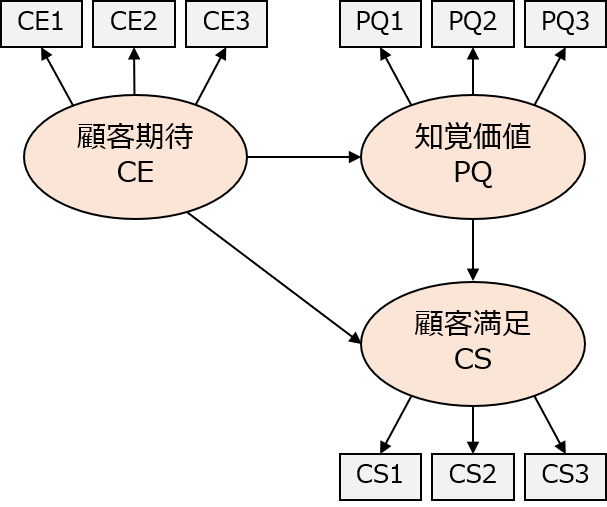
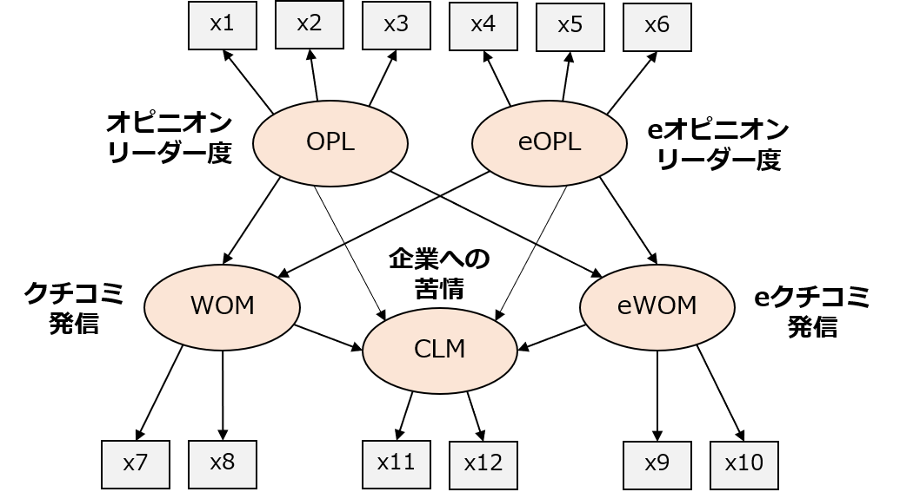

```{r setup, include=FALSE}
knitr::opts_chunk$set(echo = TRUE)

# packages
library(plotly)
library(broom)
# library(pander)
library(knitr)

# data
data_csi <- read.csv("data/data_csi.csv")
data_wom <- read.csv("data/data_wom.csv")
```

## 1. 分析例
### データ
**法政大学に対する満足度調査**

```{r, echo=FALSE}
head(data_csi)
```

| 変数 | 内容                                   |
| ---- | -------------------------------------- |
| CE1 | 入学前に期待していた大学の総合的な品質 |
| CE2 | 入学前に期待していた学生生活の充実度   |
| CE3 | 入学前に期待していた大学の信頼度       |
| PQ1 | 現在感じている大学の総合的な品質       |
| PQ2 | 現在感じている学生生活の充実度         |
| PQ3 | 現在感じている大学の信頼度             |
| CS1 | 大学に対する総合的な満足度             |
| CS2 | 入学前の期待と比べた現在の大学の評価   |
| CS3 | 他大学と比較したときの評価             |


<!-- | 変数 | 内容                                   | -->
<!-- | ---- | -------------------------------------- | -->
<!-- | CE1 $(y_1)$ | 入学前に期待していた大学の総合的な品質 | -->
<!-- | CE2 $(y_2)$ | 入学前に期待していた学生生活の充実度   | -->
<!-- | CE3 $(y_3)$ | 入学前に期待していた大学の信頼度       | -->
<!-- | PQ1 $(y_4)$ | 現在感じている大学の総合的な品質       | -->
<!-- | PQ2 $(y_5)$ | 現在感じている学生生活の充実度         | -->
<!-- | PQ3 $(y_6)$ | 現在感じている大学の信頼度             | -->
<!-- | CS1 $(y_7)$ | 大学に対する総合的な満足度             | -->
<!-- | CS2 $(y_8)$ | 入学前の期待と比べた現在の大学の評価   | -->
<!-- | CS3 $(y_9)$ | 他大学と比較したときの評価             | -->


**データ出典**：法政大学の学部授業でアンケートを実施（2018年度）

- 顧客期待（CE：Consumer Expectation），知覚価値（PQ：Perceptual Quality），顧客満足（CS：Consumer Satisfaction）について，それぞれ3問ずつ，7点リッカート尺度（1＝低い ～ 7＝高い）でアンケート収集
- 回答者数は41人


### モデル（パス図）
</br>
<!--  -->
<div style="text-align: center;">

</div>

<!-- #### 数式表記 -->
<!-- 測定方程式（確認的因子分析） -->
<!-- $$ -->
<!-- y_1 = \lambda_{11} CE + e_1 \\ -->
<!-- y_2 = \lambda_{21} CE + e_2 \\ -->
<!-- y_3 = \lambda_{31} CE + e_3 \\ -->
<!-- y_4 = \lambda_{42} PQ + e_4 \\ -->
<!-- y_5 = \lambda_{52} PQ + e_5 \\ -->
<!-- y_6 = \lambda_{62} PQ + e_6 \\ -->
<!-- y_7 = \lambda_{73} CS + e_7 \\ -->
<!-- y_8 = \lambda_{83} CS + e_8 \\ -->
<!-- y_9 = \lambda_{93} CS + e_9 -->
<!-- $$ -->

<!-- 構造方程式（回帰分析） -->
<!-- $$ -->
<!-- PQ = \beta_{11} CE + v_1 \\ -->
<!-- CS = \beta_{21} CE + \beta_{22} PQ + v_2 -->
<!-- $$ -->


### Rコード
```{r, results='hide', message=FALSE}
# データ data_csi は "Import Dataset" で読込済みとする
# lavaan パッケージの読込み
library(lavaan)

# モデル（パス図）定義
model <- "
  # 測定方程式
    CE =~ CE1 + CE2 + CE3  # 顧客期待 (CE)
    PQ =~ PQ1 + PQ2 + PQ3  # 知覚品質 (PQ)
    CS =~ CS1 + CS2 + CS3  # 顧客満足 (CS)
  # 構造方程式
    PQ ~ CE
    CS ~ CE + PQ
"

# パラメータ推定
result <- sem(model, data = data_csi)

# 推定結果の表示
summary(result, fit.measures = TRUE, standardized = TRUE)
## fit.measures = TRUE で各種モデル比較指標を表示
## standardized = TRUE で標準解を表示
```

**`sem(model, data)`：共分散構造分析の実行**

- **`model`**：モデル（パス図）定義
  - モデルは " "（または ' '）で囲んで定義する
  - モデルの書き方は下記を参照
  
- **`data`**：分析データの指定  


#### モデル（パス図）定義の書き方

**測定方程式**

- 「潜在変数 =~ 観測変数1 + 観測変数2」のように，`=~` の左側に潜在変数，右側に潜在変数を構成する観測変数を記述
- 観測変数が2個以上ある場合は `+` で追加する


**構造方程式**

- 「潜在変数1 ~ 潜在変数2 + 潜在変数3」のように，`~` の左側に「矢印を受ける潜在変数（終点）」，「矢印を出す潜在変数（始点）」を記述
- 複数の始点がある場合は `+` で追加する
- 潜在変数間の相関関係をモデル化したい場合は「潜在変数1 ~~ 潜在変数2」のように，`~~` で潜在変数をつなげる


#### Rコードの出力
```{r, echo=FALSE}
smry <- summary(result, fit.measures = TRUE, standardized = TRUE)
```


### 推定結果
（潜在変数間のパス係数のみ記載）
```{r, echo=FALSE}
par <- smry$PE
result.df <- data.frame(rname = c("知覚品質 ← 顧客期待", "顧客満足 ← 顧客期待", "顧客満足 ← 知覚品質"), 
                        par$est, par$std.all, par$se, par$z, par$pvalue)[10:12,] %>%
  kable(format = "markdown",
        row.names = FALSE,
        col.names = c("", "係数", "標準化係数", "標準誤差", "z 値", "p 値"),
        digits = 3)
result.df
```


#### パス図
```{r, message=FALSE, echo=FALSE}
library(semPlot)
semPaths(result, what = "std", style = "lisrel")
```


```{r, message=FALSE, eval=FALSE}
# semPlot パッケージによる作図プログラム
library(semPlot)
semPaths(result, what = "std", style = "lisrel")
```


## 2. 課題
### データ
**クチコミとオピニオン・リーダーに関する調査データ**


```{r, echo=FALSE}
head(data_wom)
```

| 変数     | 定義                                                         |
| -------- | ------------------------------------------------------------ |
| SampleID | 回答者ID                                                     |
| x1       | 友人や近所の人と映画についてよく話しをする                   |
| x2       | 友人や近所の人に映画の情報を教える方だ                       |
| x3       | 友人や近所の人から映画についての情報を求められる方だ         |
| x4       | インターネット上で映画について投稿したり読んだりする方だ     |
| x5       | インターネット上で映画の情報を教える方だ                     |
| x6       | インターネット上で人から映画についての情報を求められる方だ   |
| x7       | 満足，面白いと思った映画について友人などに伝える             |
| x8       | 不満，面白くないと思った映画について友人などに伝える         |
| x9       | 満足，面白いと思った映画についてインターネットの掲示板などに書き込む |
| x10      | 不満，面白くないと思った映画についてインターネットの掲示板などに書き込む |
| x11      | 不満，面白くないと思った映画について映画，配給元に電話する   |
| x12      | 不満，面白くないと思った映画について映画，配給元にメールする |

**データ出典**：里村（2014）および濱岡・里村（2009）を元に作成した架空データ

注）質問項目 x1～x12 の数値は，里村（2014）に記載された相関係数行列より復元したシミュレーションデータであり，本データによる分析結果は実際の調査データを用いた分析結果とほぼ等しい。

- [里村卓也 (2014) 『マーケティング・データ分析の基礎』共立出版](http://www.kyoritsu-pub.co.jp/bookdetail/9784320123663)
- [濱岡豊, 里村卓也 (2009) 『消費者間の相互作用についての基礎研究 : クチコミ、eクチコミを中心に』慶應義塾大学出版](http://www.keio-up.co.jp/np/isbn/9784766415971)

### モデル（パス図）
<div style="text-align: center;">

</div>

<!-- #### 数式表記 -->
<!-- 測定方程式（確認的因子分析） ⇒ 省略 -->

<!-- 構造方程式（回帰分析） -->
<!-- $$ -->
<!-- WOM = \beta_{11} OPL + \beta_{12} eOPL + v_1 \\ -->
<!-- eWOM = \beta_{21} OPL + \beta_{22} eOPL + v_2 \\ -->
<!-- CLM = \beta_{31} OPL + \beta_{32} eOPL + \beta_{41} WOM + \beta_{52} eWOM + v_3 -->
<!-- $$ -->


### 課題

