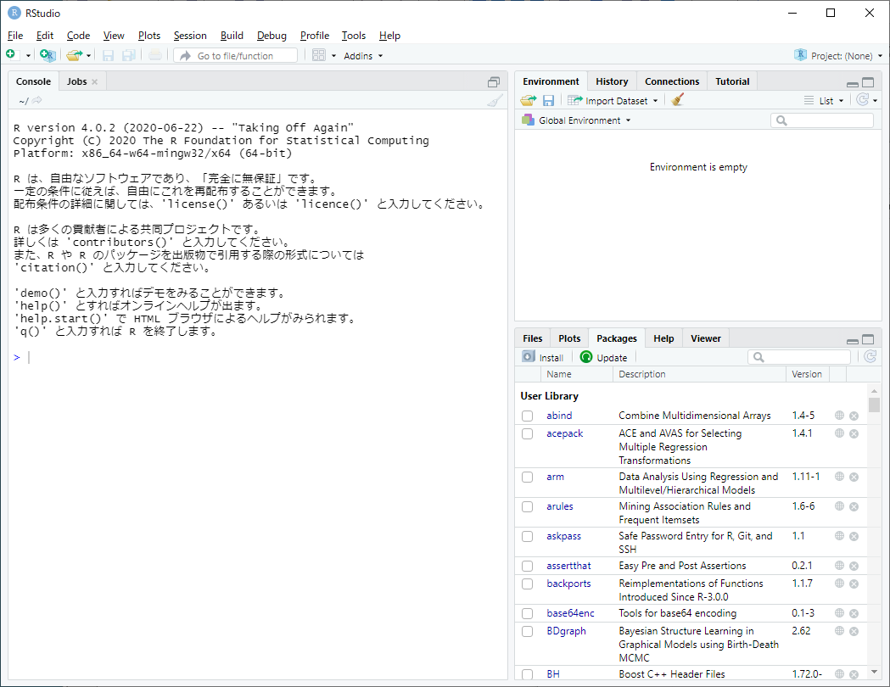
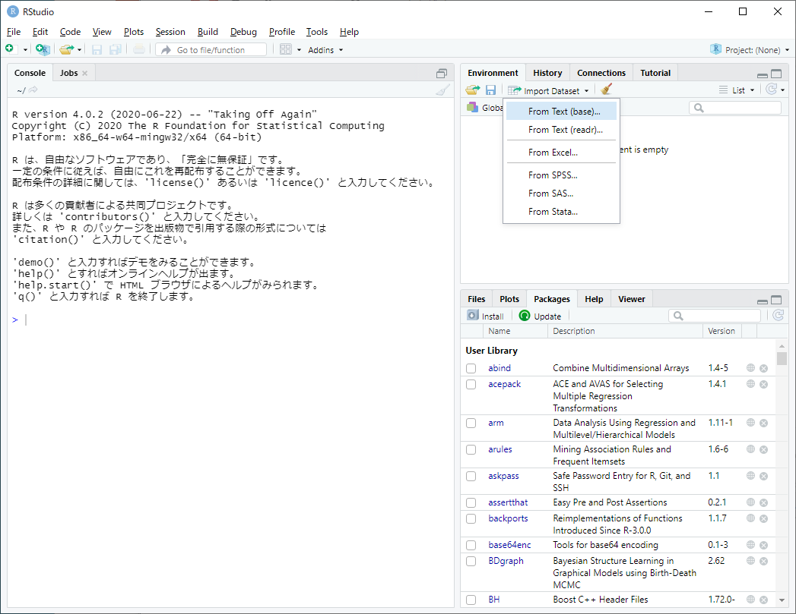
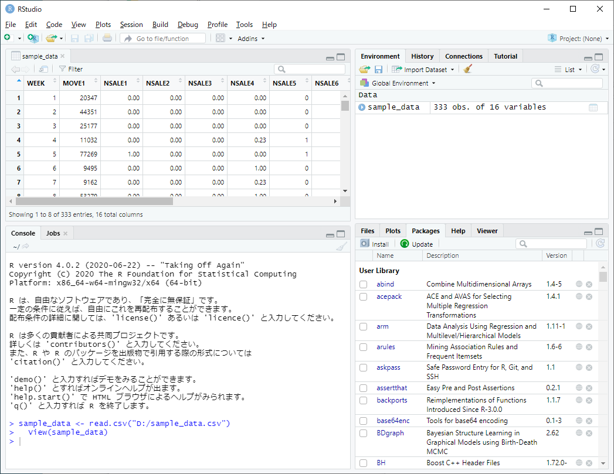
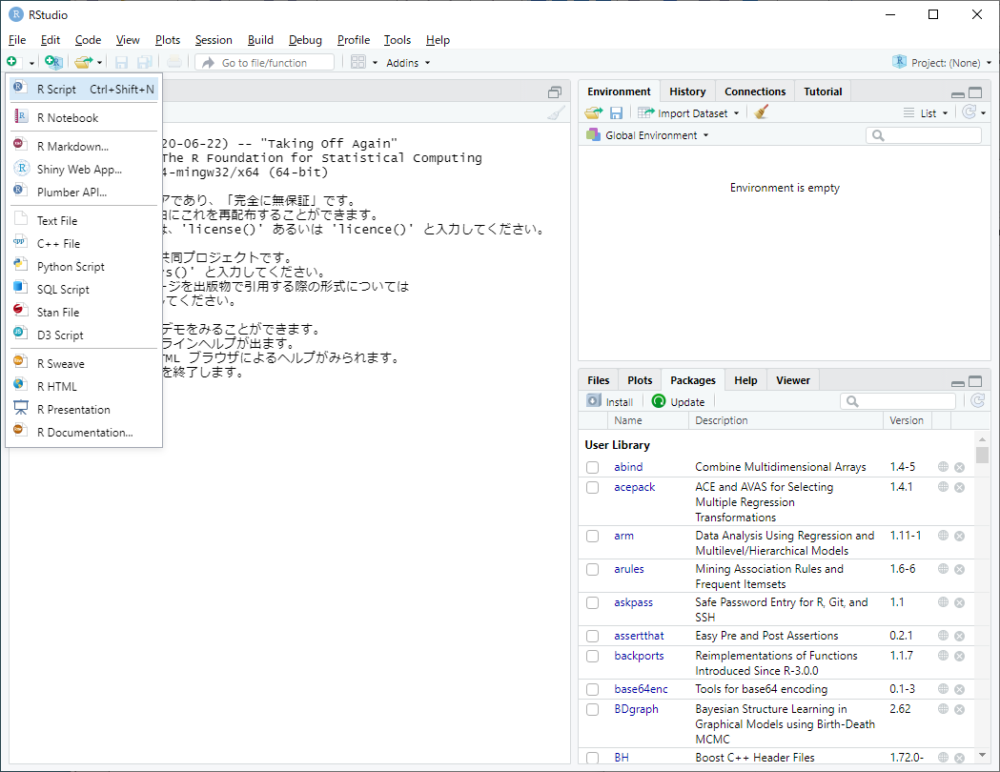
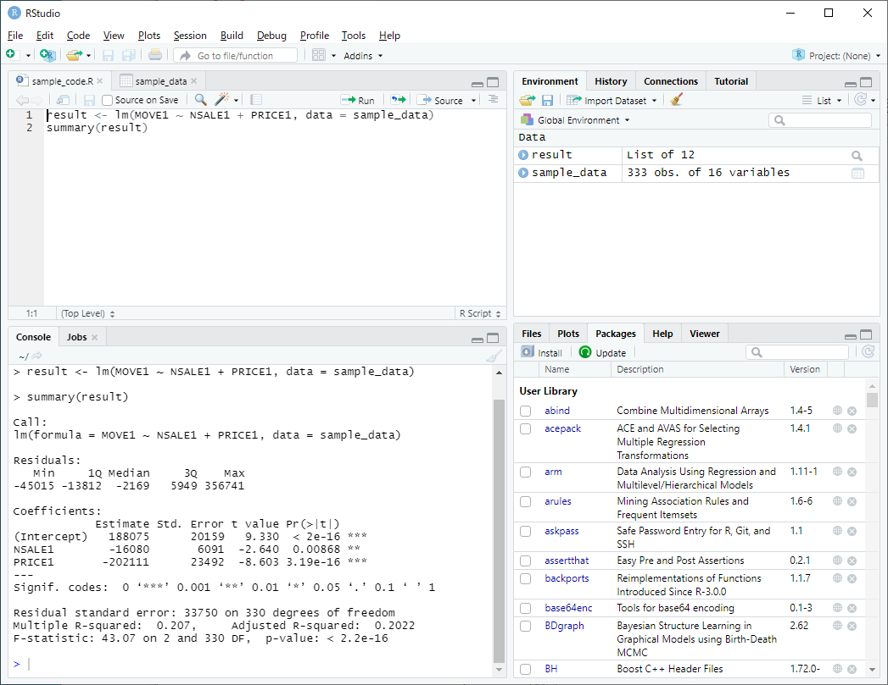

```{r setup, include=FALSE}
knitr::opts_chunk$set(echo = TRUE)
library(plotly)
```

## 1. RとRStudioのインストール
以下のwebサイトからインストーラーをダウンロードしてインストール。

- [R Project (https://www.r-project.org/)](https://www.r-project.org/)
- [RStudio (https://rstudio.com/products/rstudio/)](https://rstudio.com/products/rstudio/)  → RStudio Desktop をインストール

## 2. RStudioの使い方
### 2.1. 起動画面
<div style="text-align: center;"></div>

### 2.2. データの読み込み
右上ペインの  ボタンから "From Text (base)" を選択し，読み込みたいデータを指定。  
以下のGUIによるデータ読み込み方法はデータのファイルサイズが大きい場合に処理時間がかかる。ファイルサイズが数十メガバイト以上なら `read.table` 関数によるデータ読み込みを推奨。

<div style="text-align: center;"></div>

<br />
データ指定後には，読み込みデータに合わせて左側のオプションを変更する。とくにデータの列名（Heading）の指定に注意。

<div style="text-align: center;"></div>

<br />
データ読み込み後の画面

<div style="text-align: center;"></div>


### 2.3. プログラムの実行
#### エディタの表示
左上の  ボタンから "R Script"  を選択してRプログラムを編集するエディタを表示（または Ctrl+Shift+N）。

<div style="text-align: center;"></div>

#### プログラムの入力
エディタに実行したいプログラムを入力する。Rプログラムはファイルとして保存しておけば再利用が可能。

<div style="text-align: center;"></div>

#### 特定の行のみ実行
実行したい部分を選択してエディタ上部の  ボタンをクリック（または Ctrl+Enter）

#### 全てを一括で実行
エディタ上部の  ボタンをクリック（または Ctrl+Shift+Enter）

<br />
Rプログラム実行後の画面
<div style="text-align: center;"></div>

### 2.4. パッケージのインストール
右下のペインの Packages から  ボタンをクリックし，インストールしたいパッケージ名を入力して "Install" をクリック。

<div style="text-align: center;"></div>

## Rに関する参考サイト・書籍
- [R-Tips (http://cse.naro.affrc.go.jp/takezawa/r-tips/r2.html)](http://cse.naro.affrc.go.jp/takezawa/r-tips/r2.html)
- [R による統計処理  (http://aoki2.si.gunma-u.ac.jp/R/)](http://aoki2.si.gunma-u.ac.jp/R/)
- [松村他 (2018) 『RユーザのためのRStudio［実践］入門』技術評論社](http://gihyo.jp/book/2018/978-4-7741-9853-8)